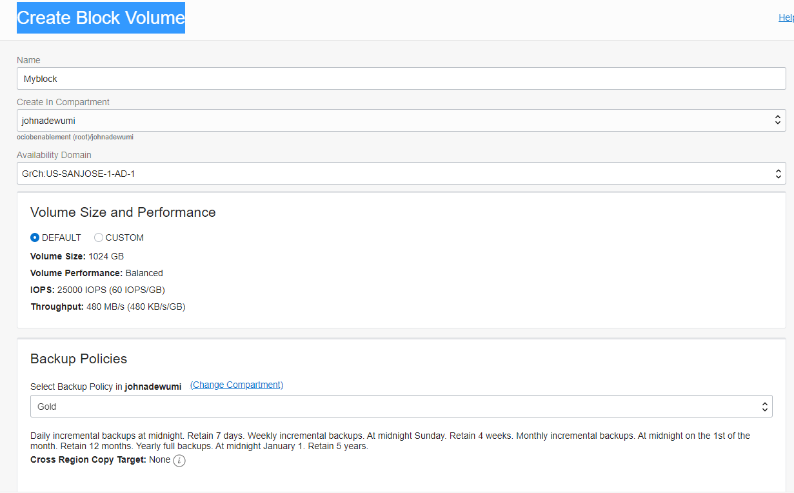
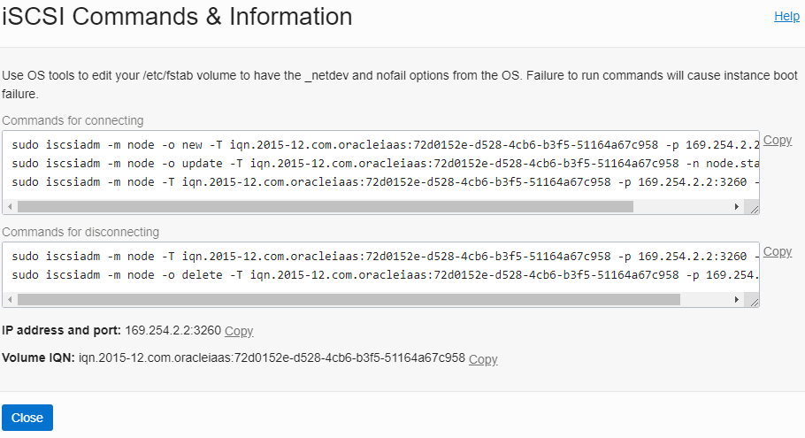
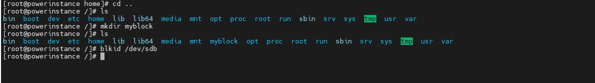
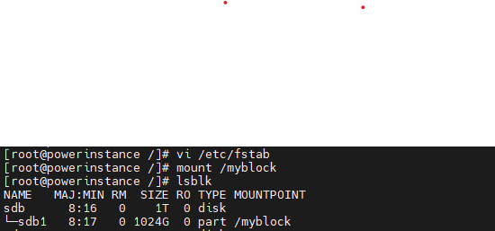

# Creating and Adding Block Volume to an Instance

*About this template: This file is used to demonstrate all of the features built into the LiveLabs conversion engine. Many of the features described here are optional and are so marked. Start with  and then follow it with .*

## Introduction

Oracle Cloud Infresatructure Block Volume is a detacheable block storage that allows you to dynamically expand the storage of an instance. The block volume is a type of data storage that is more expansive than file storage, it stores data independently and beyond the lifespan of your compute instance. Data is retained until the volume is reformatted or deleted

Block volumes are attached with the iSCSI or Paravitualised. I will be shoding you how to use the iSCSI method because it seem to require more steps in accomplishing it, this iSCSI is use for performance purpose.                                                                                               

*You may add an option video, using this format: [](youtube:YouTube video id)*

  [](youtube:zNKxJjkq0Pw)

Estimated Lab Time: 20 minutes

### Background
Enter background information here - this can include product information, or a technology overview, but also should cover what the workshop is about.

### Objectives

*List objectives for the lab - if this is the intro lab, list objectives for the workshop*

In this lab, you will:
* Locate Oracle cloud nfrastructure Block volume in the Console.
* Create a Block Volume .
* Attach a block volume to an existing instance.
* How to mount your volume and be ascessible for usage like the boot volume.
* [relative lab url test](?lab=need-help)

### Prerequisites

*Use this section to describe any prerequisites, including Oracle Cloud accounts, set up requirements, etc.*

* An Oracle Cloud Account - Please view this workshop's LiveLabs landing page to see which environments are supported
* Item no 2 with url - [URL Text](https://www.oracle.com).

*Note: If you have a **Free Trial** account, when your Free Trial expires your account will be converted to an **Always Free** account. You will not be able to conduct Free Tier workshops unless the Always Free environment is available. **[Click here for the Free Tier FAQ page.](https://www.oracle.com/cloud/free/faq.html)***

*This is the "fold" - below items are collapsed by default*

## **Step 1**: Create a Block Volume

<!-- Images -->

1. Click on the navigation menu in the upperleft, navigate to storage and select Block Volumes

    

    The image alt text is optional.

    

2. Click Create Block Volume, make sure you are in your compartment.

    

3. On the Create Block Volume

    - Name : your desired name
    - Availability domain: your AD
    - Volume side and perfrormance: Default
    - Backup Policies: Gold
    - Encryption: Encrypt using Oracle-managed keys

    

4. One example of **Block Volume**.

    

5. To navigate to your instance. Click on the navigation menu in the upperleft, navigate to compute and select instances. click on your desired instace ypu would like to attach

    


   If you add another paragraph, add 3 spaces before the beginning of the line to keep it in line with the numbered step.

## **Step 2:** Atach a Block Volume

<!-- Images -->

1. On your instance, navigate to resources and select Atached Block Volumes and click Attached Block Volume.

    


2. On  the attach block volume.

    - Volume Attachment type : iSCSI
    - Volume: Select the block volume you created
        - Device path: dev/oracleoci/oraclevdi
    - Access: Read/write

    

**fter you attach, you will have this view**

    

3. On the attached block, click on the 3dots and click on the iSCSI commamnd and information.

    

   copy the commands for connecting by clicking the copy bar on the display.

    


4. SSH into your instance and log in as root.


  	```
    <copy>ssh -i <ssh-key-file></copy>
    ```

5. Paste the Commands for connecting and also check the block volume attached.

       

    
  	```
    <copy>lsblk></copy>
    ```
   the attached volume is shown as 1TB

6. mount the attached block volume to a directory.

    - mkdir myblock
    - ls
    - blkid /dev/sdb

       

7. Creat partition to mount the block volume.

   - sgdisk -e /dev/sdb
   - sgdisk -N 1 /dev/sdb   
   - lsblk    

       


8. make sure its est format.

   - mkfs.ext4 /dev/sdb
   - lsblk
   
   to check for the blkid
   - blkid /dev/sdb1

       


9. Associating the blkid number with **myblock**

    - vi /etc/fstab
    - Copy the UUID no and input in the file configuration

       
    **wq!**

10. Mount **myblock** 
    - mount /myblock
    - lsblk 

       

    the **myblock** is ready to use like any other block volumes.  

## Acknowledgements
* **Author** - <John Adewumi, Solution, Architect, OCI>
* **Contributors** -  <Orlando Gentils, OCI> -- optional
* **Last Updated By/Date** - <Name, Group, Month Year>
* **Workshop (or Lab) Expiry Date** - <Month Year> -- optional, use this when you are using a Pre-Authorized Request (PAR) URL to an object in Oracle Object Store.
